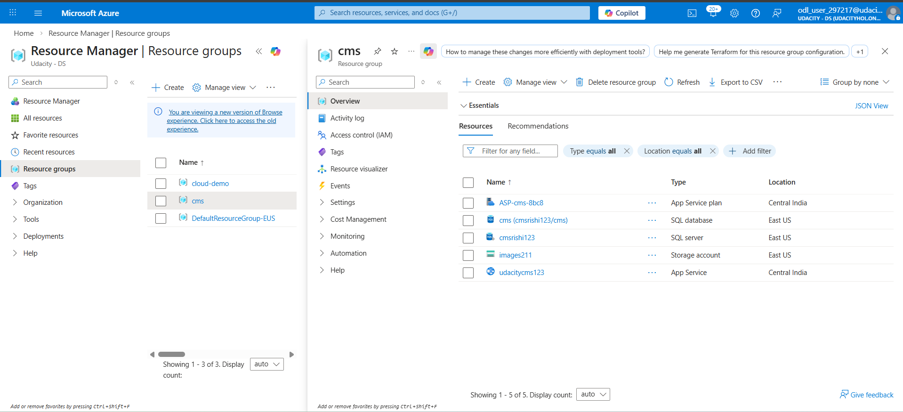
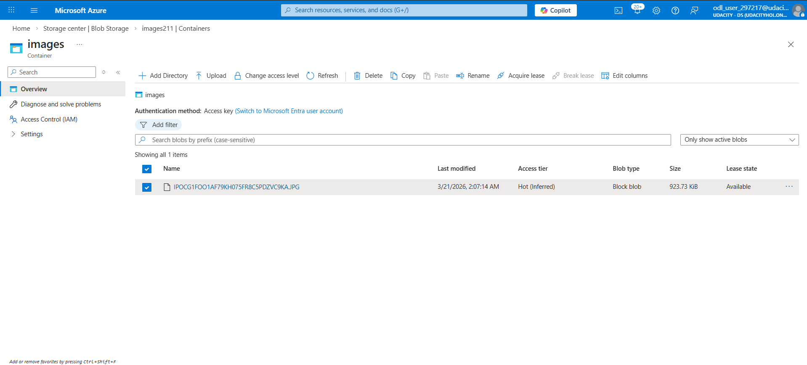
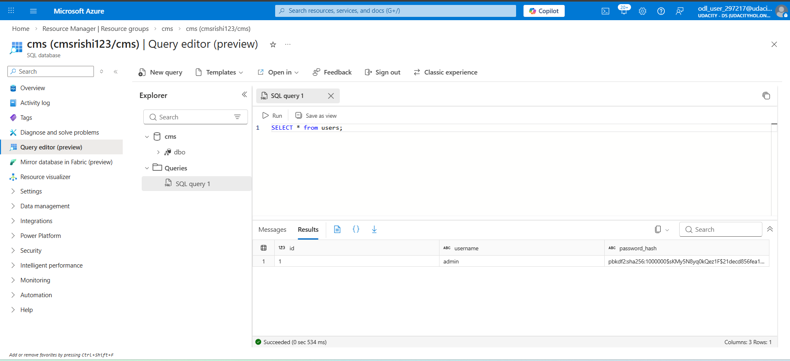
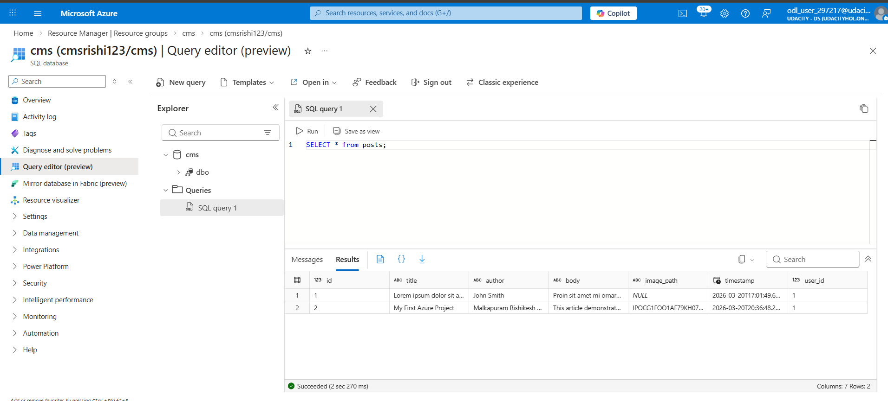
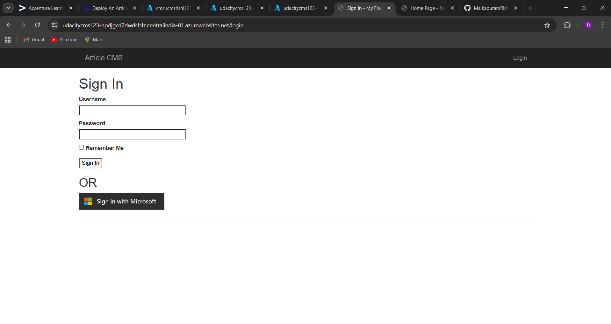
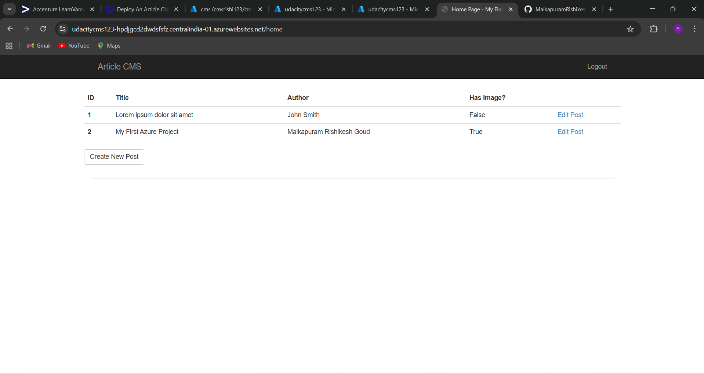
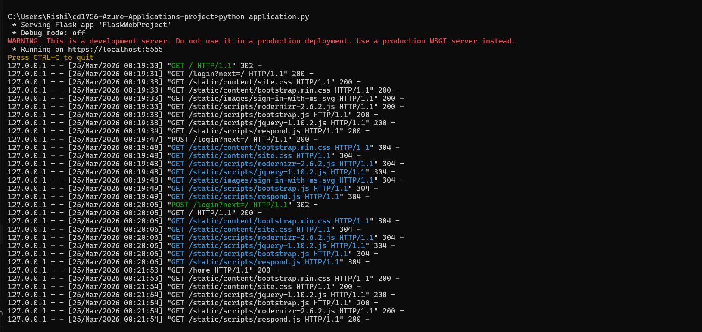
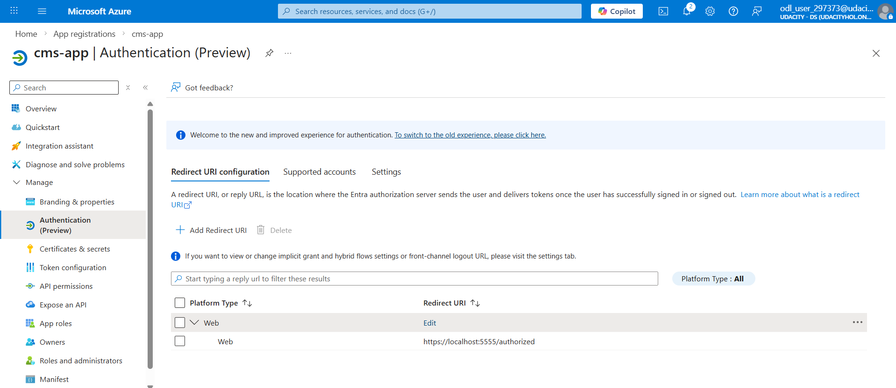

# Azure CMS Web Application (Flask)

## 📌 Project Overview

This project is a cloud-based Content Management System (CMS) built using Flask and deployed on Microsoft Azure.

The application allows users to:

* Login securely
* Create, edit, and view posts
* Upload images to Azure Blob Storage
* Store data in Azure SQL Database

---

## 🚀 Technologies Used

* Python (Flask)
* Flask-Login (Authentication)
* Flask-SQLAlchemy (Database ORM)
* Azure App Service (Deployment)
* Azure SQL Database
* Azure Blob Storage
* Gunicorn (Production server)

---

## 🌐 Live Application

https://udacitycms123-hpdjgcd2dwdsfsfz.centralindia-01.azurewebsites.net
⚠️ Note: The deployed application link may not be accessible as the Azure student subscription has expired.

---
Login Credentials:
Username: admin
Password: admin123

## 📂 Project Structure

* FlaskWebProject/ → Main application code
* requirements.txt → Python dependencies
* screenshots/ → Project proof images
* README.md → Project documentation

---

## 📸 Screenshots

### 🔹 Resource Group

### 🔹 Blob Storage (Image Upload)

### 🔹 Azure SQL Database Tables (Users & Posts)

### 🔹 Login Page

### 🔹 Home Page

---

### 🔹 Application Logs (Login Attempts)

Both successful and unsuccessful login attempts are captured in the logs:
- Failed login returns HTTP 200 (no redirect)
- Successful login returns HTTP 302 followed by HTTP 200

### 🔹 Redirect URI Configuration (MSAL)

## ⚙️ Setup Instructions

1. Clone the repository:
   git clone <your-repo-link>

2. Navigate to project folder:
   cd project-folder

3. Install dependencies:
   pip install -r requirements.txt

4. Set environment variables in Azure:

   * SQL_SERVER
   * SQL_DATABASE
   * SQL_USER_NAME
   * SQL_PASSWORD
   * BLOB_ACCOUNT
   * BLOB_STORAGE_KEY
   * BLOB_CONTAINER
   * SECRET_KEY

5. Run the application

---

## 🔐 Features

* User authentication using Flask-Login
* CRUD operations for posts
* Image upload using Azure Blob Storage
* Secure database connection using Azure SQL
* Cloud deployment using Azure App Service

---

## ✅ Status

Project successfully deployed and tested on Azure.

---

## Microsoft Authentication Note

Due to expiration of the temporary Azure account, live Microsoft login cannot be demonstrated.

However:
- MSAL authentication is fully implemented in code (views.py)
- Redirect URI configuration is provided via screenshots
- The feature was tested successfully before account expiration

---

## 👨‍💻 Author

Rishikesh Goud
